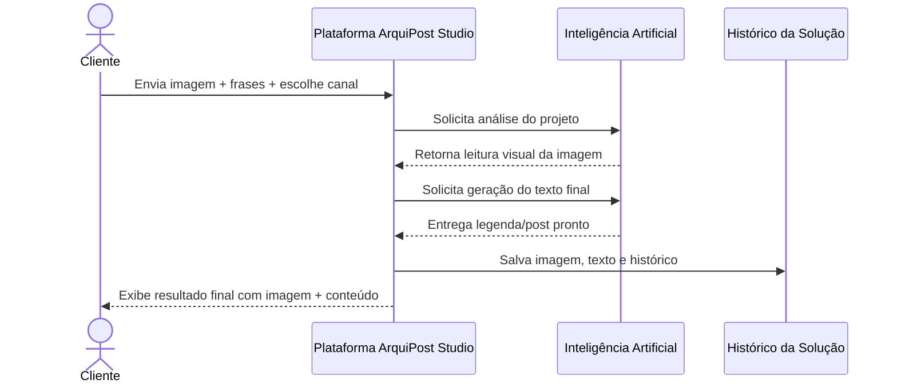
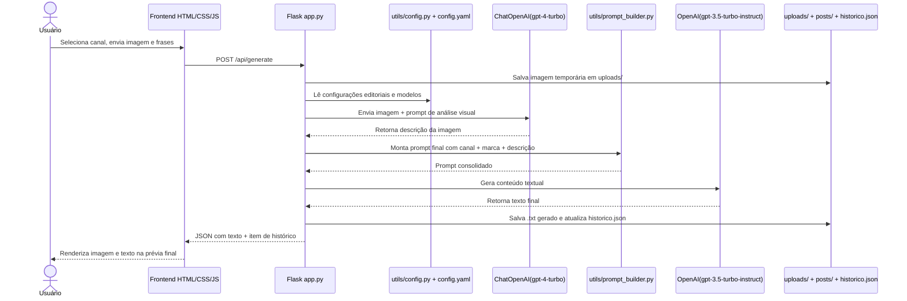

# ArquiPost Studio

Aplicação web em pt-BR para geração de conteúdo editorial de arquitetura com IA.  
A solução foi desenhada para escritórios que precisam transformar imagens de projetos em textos prontos para `Blog`, `Instagram` e `LinkedIn`, com uma interface mais próxima de produto final e uma operação simples para usuários não técnicos.

## Visão Geral

O usuário envia a imagem do projeto, escreve até 3 frases de contexto e escolhe o canal de saída.  
A aplicação analisa a imagem com IA, monta um prompt com base nas configurações editoriais do escritório e gera o texto final já pronto para revisão e publicação.

Além da geração, a solução também permite:

- ajustar o nome do escritório;
- editar tom de voz, persona, tagline e objetivo editorial;
- escolher o canal padrão;
- visualizar histórico de gerações;
- revisar imagem e texto juntos no resultado final.

## Canais Suportados

- `Blog`
- `Instagram`
- `LinkedIn`

Cada canal possui regras próprias de estrutura, tamanho e estilo, definidas em [`config.yaml`](./config.yaml).

## Arquitetura da Solução

### Camadas principais

- `Frontend`: HTML, CSS e JavaScript
- `Backend`: Flask
- `Configuração`: YAML centralizado
- `Geração de texto`: LangChain + OpenAI
- `Análise de imagem`: LangChain + OpenAI multimodal
- `Persistência local`: arquivos em `posts/` e `uploads/`

### Arquivos principais

- [`app.py`](./app.py): servidor Flask e rotas HTTP
- [`templates/index.html`](./templates/index.html): interface principal
- [`static/styles.css`](./static/styles.css): estilo visual
- [`static/app.js`](./static/app.js): comportamento do frontend
- [`utils/config.py`](./utils/config.py): leitura e atualização da configuração
- [`utils/prompt_builder.py`](./utils/prompt_builder.py): montagem dos prompts
- [`utils/generator.py`](./utils/generator.py): orquestração da geração
- [`utils/image_description_gpt.py`](./utils/image_description_gpt.py): descrição da imagem com IA
- [`config.yaml`](./config.yaml): branding, canais, prompts e modelos

## Tech Stack

- `Python 3`
- `Flask`
- `Jinja2`
- `HTML5`
- `CSS3`
- `JavaScript`
- `PyYAML`
- `python-dotenv`
- `LangChain`
- `langchain-openai`
- `OpenAI API`
- `gpt-4-turbo` para interpretação da imagem
- `gpt-3.5-turbo-instruct` para geração do texto da publicação

## Como Executar

```bash
pip install -r requirements.txt
copy .env.example .env
python app.py
```

Depois, abra:

```txt
http://127.0.0.1:5000
```

## Variáveis de Ambiente

Preencha o arquivo `.env` com sua chave:

```bash
OPENAI_API_KEY=sk-xxxxx
```

## Configuração Editorial

O arquivo [`config.yaml`](./config.yaml) concentra:

- nome do produto;
- nome do escritório;
- tagline;
- persona;
- tom de voz;
- objetivo editorial;
- prompts globais;
- prompts por canal;
- modelos usados;
- parâmetros de temperatura e geração.

Pela interface, o usuário edita apenas a camada superficial da marca.  
As regras mais estruturais continuam centralizadas no YAML.

## Fluxo da Solução

1. O usuário acessa a interface web.
2. Seleciona o canal desejado.
3. Faz upload da imagem do projeto.
4. Informa até 3 frases de contexto.
5. O backend recebe os dados e salva a imagem em `uploads/`.
6. A imagem é enviada para análise multimodal.
7. A descrição visual é combinada com as regras do canal e da marca.
8. O texto final é gerado.
9. O resultado é salvo em `posts/` e `posts/historico.json`.
10. A interface exibe a imagem e o texto juntos para revisão.

## Explicação da Sequência de Ações

### Versão narrativa para usar no NotebookLM

A solução começa quando o usuário acessa a interface web, escolhe o canal de saída e envia a imagem do projeto junto com até três frases de contexto. Essas frases funcionam como orientação editorial para explicar o conceito do ambiente, materiais, atmosfera, público-alvo ou qualquer outra intenção do escritório.

Quando o envio é feito, o backend Flask recebe a requisição, salva a imagem localmente e consulta o arquivo `config.yaml`. Esse arquivo centraliza as configurações que entram no sistema, como nome do escritório, persona editorial, tom de voz, objetivo da marca, regras de cada canal, limites de palavras e prompts utilizados ao longo da geração.

Depois disso, a solução faz o primeiro acesso a LLM. A imagem é enviada para um modelo multimodal, atualmente o `gpt-4-turbo`, responsável por interpretar visualmente o projeto. Esse modelo devolve uma descrição da imagem com foco em leitura arquitetônica, materiais, composição, atmosfera e função do ambiente.

Na sequência, a aplicação monta um prompt final consolidado. Esse prompt une três grupos de informação: o contexto fornecido pelo usuário, a descrição visual produzida pela IA e as regras editoriais definidas no `config.yaml`.

Com esse prompt pronto, acontece o segundo acesso a LLM. O modelo `gpt-3.5-turbo-instruct` recebe essas instruções e gera o texto final da publicação, adaptado ao canal selecionado, respeitando estilo, estrutura, tom e objetivo editorial.

Depois da resposta do modelo textual, a aplicação ainda aplica regras finais de controle, como o limite máximo de palavras para Blog e LinkedIn, evitando saídas longas demais ou com aparência de corte amador. Por fim, o sistema salva o texto em arquivo `.txt`, atualiza o histórico local e devolve ao usuário uma prévia final com a imagem e o conteúdo juntos no mesmo bloco visual.

### Entradas que alimentam o sistema

- imagem do projeto;
- até 3 frases de contexto;
- canal escolhido pelo usuário;
- configurações editoriais do `config.yaml`;
- chave da OpenAI informada no ambiente.

### Saídas produzidas pelo sistema

- descrição visual da imagem;
- texto final da publicação;
- arquivo `.txt` salvo localmente;
- registro estruturado no histórico com data, canal, modelos e imagem.

## Diagrama de Sequência: Visão Não Técnica



Esse diagrama é o mais indicado para apresentação ao cliente não técnico, porque mostra o comportamento da solução sem expor detalhes de implementação.

## Diagrama de Sequência: Visão Técnica



Esse diagrama é o mais indicado para documentação técnica, onboarding de desenvolvimento e evolução da arquitetura.

## Regras Importantes da Solução

- O nome da ferramenta `ArquiPost Studio` não deve aparecer no texto gerado nem nas hashtags.
- Quando houver menção de marca, o texto deve usar apenas o nome do escritório configurado.
- A experiência da interface é pensada para pt-BR, incluindo acentuação e rótulos.
- O histórico é salvo localmente em arquivo JSON.

## Melhorias Futuras Sugeridas

- pós-processamento para bloquear termos proibidos antes de exibir o resultado;
- exportação em formatos adicionais;
- autenticação de usuários;
- armazenamento em banco de dados;
- templates de saída por tipologia de projeto;
- painel administrativo para edição mais avançada dos prompts.
